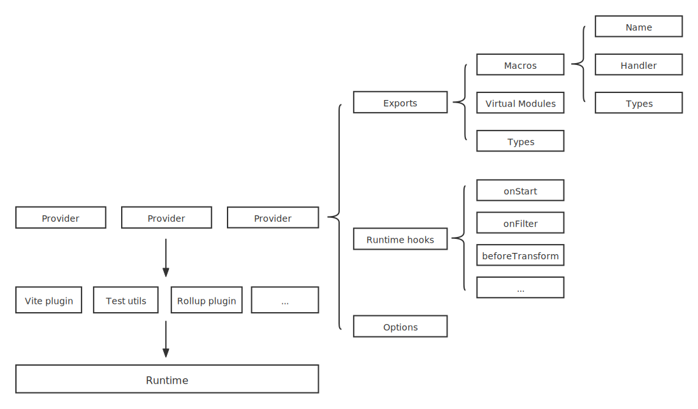

# Documentation

## Table of content

- [Getting Started](#getting-started)
- [Concepts](#concepts)
- [Tutorial for macro users](#tutorial-for-macro-users)
- [Tutorial for macro authors](#tutorial-for-macro-authors)

## Getting Started

- To create macros for other projects,
  you can use **@typed-macro/core** to define macros,
  and optionally **@typed-macro/test-utils** to test macros.

  ```shell
  $ npm install -D @typed-macro/core @typed-macro/test-utils
  # or
  $ yarn add -D @typed-macro/core @typed-macro/test-utils
  ```

- To use macros in your projects,
  you can use runtime wrappers:
  - [vite-plugin-macro](packages/wrapper-vite/README.md)
  - coming soon...

## Concepts

[](#concepts)

**Macro**: an ast transform handler with name, call signatures and optional related types

**Provider**: packages macros, virtual modules, and runtime hooks, etc.

**Runtime**: consumes providers, and provides function to use macros, virtual modules, and hooks.

**Wrapper**: makes runtime work in dev/build processes on different bundlers/dev servers.

## Tutorial for macro users

You can treat macros as normal functions that cannot be re-assigned:  
they have parameter types, return value types, comments, overloading, and can be nested;
no special syntax, no special characters.

```typescript
// import macros like normal functions,
import { echo } from '@macro'
// or give an alias?
import { echo as _echo } from '@macro'
// or even import as namespace?
import * as macros from '@macro'
// default import is the same as namespace import!
import _macros from '@macro'

// use macros like normal functions
echo()
_echo()
macros.echo()
_macros.echo()

// macros can be nested
_macros.reverse(_macros.reverse('hello'))

// macros can be shadowed
{
  const echo = () => console.log('hello')
  echo() // it's not a macro call
}

// The only thing you can't do is changing the imported macros,
// like assign the imported macro to another variable
// and use it by the variable
const localEcho = macros.echo
localEcho() // please don't do it.

// Suppose the macro has a function type `(): void`
console.log(echo()) // `Void function return value is used` is reported because there are types!

// or even import types if have!
import type { XXX } from '@macros'
let a: XXX
```

A type declaration file will be generated when bundler/dev server starts;
you can either add the generated `d.ts` file to your `tsconfig.json` like

```json
{
  "include": ["path/to/the/d.ts/file"]
}
```

or import it in your existed `d.ts` in project using [triple-slash directives](https://www.typescriptlang.org/docs/handbook/triple-slash-directives.html) like

```typescript
/// <reference path="path/to/the/d.ts/file" />
```

**If you need to check types in CI environment, please put the type declaration file under version control.**

## Tutorial for macro authors

You can define macros and package them into a provider using `@typed-macro/core`.

Here is an example below. For more details, see [@typed-macro/core](packages/core/README.md).

```typescript
import { defineMacro, defineMacroProvider } from '@typed-macro/core'

const helloMacro = defineMacro(`hello`)
  .withCustomType(`export type Message = string`)
  .withSignature(
    `(msg?: Message): void`,
    `output message with leading 'Hello, '`
  )
  .withHandler((ctx, babel, helper) => {
    const { path, args } = ctx
    const { template, types } = babel

    let msg: string
    if (args.length === 0) msg = 'World'
    else {
      const firstArg = args[0]
      if (!firstArg.isStringLiteral())
        throw new Error('please use literal string as message')
      msg = firstArg.node.value
    }

    path.replaceWith(template.statement.ast(`console.log("Hello, ${msg}")`))
  })

export function provideHello() {
  return defineMacroProvider({
    id: 'test',
    exports: {
      '@macros': {
        macros: [helloMacro],
      },
    },
  })
}
```

There are several utils in `@typed-macro/test-utils`
with which you can write some tests for your macros and providers.

For more details, see [@typed-macro/test-utils](packages/test-utils/README.md).
